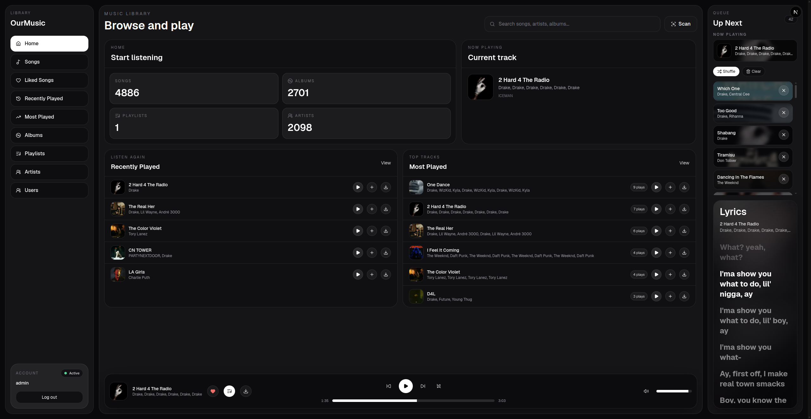
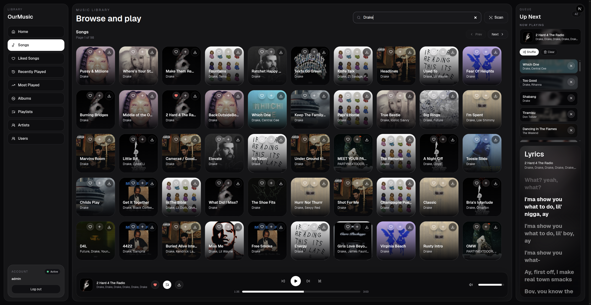
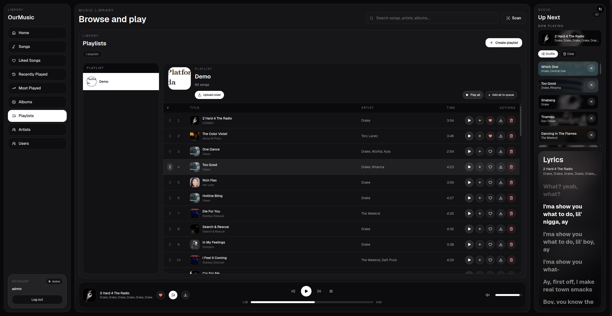

# OurMusic

OurMusic is a self-hosted music server with a modern web player and a Subsonic/OpenSubsonic-compatible API. It scans your local music folder into PostgreSQL, reads audio metadata and embedded artwork, serves the library through the web app, and also works with Subsonic clients such as Feishin, Supersonic, and Substreamer.

## Tech Stack

- Frontend: Next.js 16, React 19, TypeScript, Tailwind CSS
- Backend: Java 21, Javalin 6
- Database: PostgreSQL
- Audio metadata: jaudiotagger
- Auth: session cookies for the web app, Subsonic query/form auth for clients
- Optional transcoding: FFmpeg
- Packaging: Maven shaded jar and Docker Compose

## Features

- Scan a local music folder into a structured PostgreSQL library
- Browse songs, albums, artists, genres, playlists, liked songs, recently played songs, and stats
- Play and download tracks from the web player
- Create, update, reorder, delete, and import playlists
- Import playlist tracks from `.m3u8` files
- Upload playlist cover art
- Fetch lyrics from `lrclib.net`
- Extract embedded song/album artwork from audio files
- Store richer stream metadata such as bitrate, sample rate, channels, bit depth, year, track number, and disc number
- Manage users, admin access, password updates, sessions, liked songs, and recently played history
- Expose a Subsonic/OpenSubsonic API for external music clients

## Subsonic Support

OurMusic registers Subsonic endpoints as both `.view` and non-`.view` routes. Endpoints accept both `GET` and `POST`, and parameters can come from the query string or form body.

Implemented areas:

- System: `ping`, `getLicense`, `startScan`, `getScanStatus`, `getOpenSubsonicExtensions`
- Library: `getMusicFolders`, `getArtists`, `getIndexes`, `getArtist`, `getArtistInfo2`, `getAlbum`, `getAlbumInfo2`, `getSong`
- Album lists: `getAlbumList`, `getAlbumList2`
- Search and discovery: `search3`, `getGenres`, `getSongsByGenre`, `getRandomSongs`
- Playback and media: `stream`, `download`, `getCoverArt`
- Playlists: `getPlaylists`, `getPlaylist`, `createPlaylist`, `updatePlaylist`, `deletePlaylist`
- Stars and scrobbling: `getStarred`, `getStarred2`, `star`, `unstar`, `scrobble`
- Users: `getUser`, `createUser`, `updateUser`, `deleteUser`

Supported Subsonic auth modes:

- Legacy password auth: `u=admin&p=password`
- Hex encoded password auth: `p=enc:<hex>`
- Token/salt auth: `u=admin&t=<md5>&s=<salt>`

## How It Works

- The backend loads config from environment variables first.
- If an environment value is missing, it falls back to `application.properties` from the backend resources.
- The scanner reads audio files from the configured music path.
- Tags and technical audio metadata are upserted into PostgreSQL.
- Songs are keyed by file path, so rescans update existing rows instead of duplicating tracks.
- Embedded artwork is extracted when available and saved into the configured artwork path.
- Artists, albums, songs, playlists, playlist artwork, users, sessions, likes, recently played history, and play counts are stored in PostgreSQL.
- The frontend uses session cookies, while Subsonic clients authenticate through Subsonic-compatible request parameters.

## Configuration

Create your local env file:

```bash
cp .env.example .env
```

Generate a Subsonic auth secret:

```bash
openssl rand -base64 32
```

### Local Java Configuration

For a local Maven run, export the `.env` values before starting the backend:

```env
DB_URL=jdbc:postgresql://localhost:5432/ourmusic
DB_USER=ourmusic_user
DB_PASSWORD=change_me

MUSIC_PATH=/path/to/music
ARTWORK_PATH=/path/to/ourmusic-artwork

OURMUSIC_PORT=8808
FRONTEND_PORT=3000
CORS_ALLOWED_ORIGINS=http://localhost:3000
SESSION_COOKIE_SECURE=false

ADMIN_USERNAME=admin
ADMIN_PASSWORD=ourmusic

FFMPEG_PATH=
SUBSONIC_AUTH_SECRET=change_me_generated_secret
REQUEST_LOGGING_ENABLED=true
```

### application.properties Fallback

If an environment variable is not set, the backend can fall back to `application.properties` on the Java classpath.

Example:

```properties
db.url=jdbc:postgresql://localhost:5432/ourmusic
db.user=ourmusic_user
db.password=change_me

music.path=/path/to/music
artwork.path=/path/to/ourmusic-artwork

admin.username=admin
admin.password=ourmusic

ourmusic.port=8808
cors.allowed.origins=http://localhost:3000
session.cookie.secure=false

ffmpeg.path=
subsonic.auth.secret=change_me_generated_secret
request.logging.enabled=true
```

Notes:

- `MUSIC_PATH` is your host music folder.
- `ARTWORK_PATH` is where OurMusic stores extracted and uploaded artwork.
- Set `SESSION_COOKIE_SECURE=true` when serving the app over HTTPS.
- Set a stable `SUBSONIC_AUTH_SECRET` before using token/salt auth in real clients.
- FFmpeg is only needed for optional `stream.view` transcoding.

## Running Locally

Install frontend dependencies:

```bash
npm ci --prefix frontend
```

Run the frontend:

```bash
npm run dev --prefix frontend
```

Compile the backend:

```bash
mvn -q compile
```

Run the backend with `.env` exported:

```bash
set -a
source .env
set +a
mvn -q compile exec:java -Dexec.mainClass=Server
```

The backend listens on `OURMUSIC_PORT`, usually:

```text
http://localhost:8808
```

## Building The Jar

Build the shaded backend jar:

```bash
mvn clean package
```

Run it:

```bash
set -a
source .env
set +a
java -jar target/OurMusic-0.1.0.jar
```

## Running With Docker

Docker Compose uses the same `.env` file:

```bash
cp .env.example .env
```

Start PostgreSQL, the backend, and the frontend:

```bash
make docker-up
```

The Docker frontend listens on `FRONTEND_PORT`, usually:

```text
http://localhost:3000
```

Check running containers:

```bash
make docker-ps
```

View backend logs:

```bash
make docker-logs
```

Rebuild after backend or frontend code changes:

```bash
make docker-restart
```

Stop the stack:

```bash
make docker-down
```

Delete the Docker database volume and start fresh:

```bash
make docker-reset
```

## Screenshots

### Home



### Songs



### Playlists


